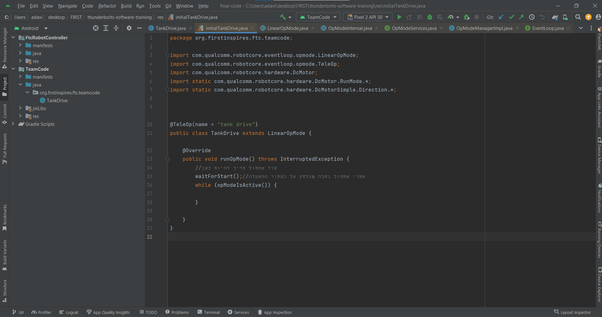
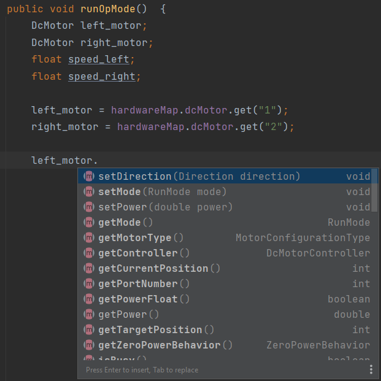

# שיעור #1 
בשיעור זה נפעיל בעל שני מנועים שיסע בצורת טנק
לפני שנתחיל לכתוב קוד אנחנו צריכים להבין קצת לגבי השפה java.  
## משתנים  
בשפה יש לנו משתנים שיכולים ליכולים להגדיר. לכל  משתנה יש שם וסוג מידע.  

`float speed;`  
`DcMotor drive_motor;`  
  
כאן הגדרנו שני משתנים. אחד בעל השם `speed` והסוג `float` שמייצג מספר עם נקודה עשורנית. והשני בעל השם `drive_motor` והסוג `DcMotor` שמייצג מנוע בקוד ומאפשר לנו להשתמש במנוע הפיזי.  

אחרי שהגדרנו משתנה אנחנו יכולים להציב בו ערך על ידי הסימן `=`. משמאל לסימן צריך להיות המשתנה שאנחנו רוצים להציב בו ומימין הערך שאחנו רוצים להציב. אחרי כך נוכל גם להשתמש בערך שהצבנו

`speed=0.5;`  
`speed=speed+1.0;`  

בדוגמה הזו  הצבנו במשתנה `speed` את הערך חצי (0.5). אחרי כך  הצבנו ב`speed` ערך חדש, הערך שב`speed` ועוד אחד (1). אחרי ההצבה השניה, הערך שבמשתנה `speed` כבר לא חצי (0.5) אלא אחד וחצי (1.5).  

הסוג מתשנה `float` נחשב סוג משתנה פשוט משום שהוא רק מכיל ערך מתמטי, הוא חלק מjava. לעומתו סוג המתשנה `DcMotor` שמייצג משהו פיזי מורכב יותר שמאפשר לנו להפעיל את הדבר הפיזי הוא מייצג. `DcMotor` הוא לא חלק מjava, הוא חלק מהסיפריות שאנחנו משתמשים בהן. בגלל ש`DcMotor` ועוד סוגי משתנה שנלמוד עליהם בהמשך מפעילים משהו פיזי, יש לנו כלים מיוחדים שבעזרתם אנחנו מציבים ערכים במשתנים מסוגים כאלו. בדוגמה שלנו יש לנו מפה שיש בו את כל רכיבים שמחוברים לרבוט ואת השמות שלהם ואנחנו יכולים בעזרת המפה לבקש את הערכים של המנועים.  

`left_motor = hardwareMap.dcMotor.get("1");`  

כאן נגשו למפה `hardwareMap` לחלק של המנועים `dcMotor` וביקשנו את הערך של מנוע שהשם שלו הוא "1" `.get("1")`.  
שימו לב לשימוש ב`.`, זו הדרך העיקרים להשתמש במשתנה מורכבים.  
שכדי שהקוד שאנחנו כותבים ירוץ אחנו צריכים שמשהו חיצוני יקרא לו. בשיעור הזה נכתוב את הקוד בתוך פונקציה שנקראת `runOpMode`.  
## פונציה 
כדי שהקוד שלנו ירוץ צריך לקרוא לו ממקום חיצוני. לשם כך אחנו צריכים פונקציה, כרגע אתם יכולים לחשוב על פונציה פשוט כדרך לתת לקטע קוד שם ודרך השם ניתן להריץ אותו.  
```
public void run(){
  float speed;
  speed =0.5;
  speed =speed +1;
}
```  
הקוד בתוך הסוגריים המשולשלות `{}` הוא הקוד שירות שכהפונציה תקרא.
## כתיבת קוד  
התוכנה Android Studio צריכה להיות עכשיו פתוחה מולכם ואתם אמורים לראות מסך שדומה לזה:  

כשאתם כותבים קוד תזכרו לשים `;` בסוף כל שורה.  
<details>
<summary dir="rtl"> תתחילו בהגדרת שני מנועים ושני מספרים בתוך הפונקציה `runOpMode`</summary>  
  
```
    public void runOpMode() {
        DcMotor left_motor;
        DcMotor right_motor;
        float speed_left;
        float speed_right;

        waitForStart();
```
</details>  
<details>
<summary dir="rtl"> תציבו ערכים בשני המנועים </summary>  
  
```
    public void runOpMode() {
        DcMotor left_motor;
        DcMotor right_motor;
        float speed_left;
        float speed_right;

        left_motor = hardwareMap.dcMotor.get("1");
        right_motor = hardwareMap.dcMotor.get("2");

        waitForStart();
```
</details>  

### מנועים  

לייצוג שלנו למנועים (המשתנים מסוג DcMotor) יש כמה פעולות שנותנות לנו לשנות את ההגדרות של המנועים הפיזי. אנחנו יכולים להשתמש בפעולות האלו בעזרת כתיבת השם של המנוע שאנחנו רוצים לשנות בו את ההגדרות ואחרי השם `.`. תנסו לכתוב `.left_motor` במחשב שלכם ותראו תפריט של פעולות שאפשר לבצע על המנוע. אפשר לבחור בתפריט הזה בעזרתם החצים ⬆️⬇️ ו-enter.    

  

אנחנו נשתמש בפעולות:  

* &#x200f;`()setPower.` - להגדרת מהירות הסיבוב של המנוע כאחוז. מספר בין אחד (1) למינוס אחד (1-)  
* &#x200f;`()setDirection.` - להגדרת הכיוון סיבוב של המנוע כאשר המהירות חיובית. `FORWARD` או `REVERSE`  
* &#x200f;`()setMode.` - הגדרת סוג הפעולה של המנוע. יש רק סוג פעולה אחד שרלוונטי עכשיו `RUN_WITHOUT_ENCODER`  
בתוך הסוגריים של כל פעולה אתם צריכים להיות את הערך שאתם רוצים שהפעולה תגדיר בהגדרות של המנוע. לדוגמה:

```
  left_motor.setDirection(FORWARD);
```  

<details>
<summary dir="rtl"> תגדיר עכשיו את הכיוון של כל אחד מהמנועים ואת הסוג פעולה שלו </summary>  
  
```
    public void runOpMode() {
        DcMotor left_motor;
        DcMotor right_motor;
        float speed_left;
        float speed_right;

        left_motor = hardwareMap.dcMotor.get("1");
        right_motor = hardwareMap.dcMotor.get("2");

        left_motor.setMode(RUN_WITHOUT_ENCODER);
        right_motor.setMode(RUN_WITHOUT_ENCODER);

        left_motor.setDirection(FORWARD);
        right_motor.setDirection(REVERSE);
        waitForStart();
```
</details>  
השורה שבה כתוב `waitForStart();` מפרידה בין קוד שקורה לפני הפעלה של הרובוט ובין קוד שקורת אחרי הפעלת הרובוט. קוד לפני השורה הזאת בעיקר ישמש להגדרת משתנים והגדרות שלא ישתנו במהלך הפעולה של הרובוט. קוד אחרי השורה הזאת בעיקר ישנה הדגרות במנוע כמו מנועים (אם תנסו לשנות את מהירות המנועים לפני הפעלת הרובוט, הם לא יסכימו לקבל את השינוי).  
<details>
<summary dir="rtl"> תוסיפו קוד שיגדיר למנועים ל </summary>  
  
```
    public void runOpMode() {
        DcMotor left_motor;
        DcMotor right_motor;
        float speed_left;
        float speed_right;

        left_motor = hardwareMap.dcMotor.get("1");
        right_motor = hardwareMap.dcMotor.get("2");

        left_motor.setMode(RUN_WITHOUT_ENCODER);
        right_motor.setMode(RUN_WITHOUT_ENCODER);

        left_motor.setDirection(FORWARD);
        right_motor.setDirection(REVERSE);

        waitForStart();

        left_motor.setPower(0.5);
        right_motor.setPower(0.5);
```
</details>  

