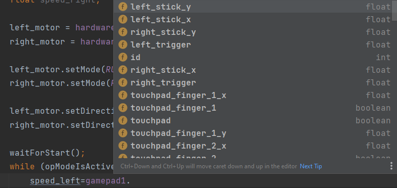

# שיעור #1 
בשיעור זה נפעיל רוטב בעל שני מנועים שתנהגו בו כמו טנק  
לפני שנתחיל לכתוב קוד אנחנו צריכים להבין קצת לגבי השפה java.  
## משתנים  
בשפה יש לנו משתנים שאנחנו ליכולים להגדיר ולהשתמש בהם אחר כך. לכל  משתנה יש שם וסוג מידע.  

`float speed;`  
`DcMotor drive_motor;`  
  
כאן הגדרנו שני משתנים. אחד בעל השם `speed` והסוג `float` שמייצג מספר עם נקודה עשרונית. והשני בעל השם `drive_motor` והסוג `DcMotor` שמייצג מנוע בקוד ומאפשר לנו להשתמש במנוע הפיזי.  

אחרי שהגדרנו משתנה אנחנו יכולים להציב בו ערך על ידי הסימן `=`. משמאל לסימן צריך להיות המשתנה שאנחנו רוצים להציב בו ומימין הערך שאחנו רוצים להציב. אחרי כך נוכל גם להשתמש בערך שהצבנו

`speed=0.5;`  
`speed=speed+1.0;`  

בדוגמה הזו  הצבנו במשתנה `speed` את הערך חצי (0.5). אחרי כך  הצבנו ב`speed` ערך חדש, הערך שב`speed` פלוס אחד (1). אחרי ההצבה השניה, הערך שבמשתנה `speed` כבר לא חצי (0.5) אלא אחד וחצי (1.5).  

הסוג משתננה `float` נחשב סוג משתנה פשוט משום שהוא רק מכיל ערך מתמטי, הוא חלק מjava. לעומתו סוג המתשנה `DcMotor` שמייצג משהו פיזי מורכב יותר ומאפשר לנו להפעיל את הדבר הפיזי הוא מייצג. `DcMotor` הוא לא חלק מjava, הוא חלק מהסיפריה שאנחנו משתמשים בה. בגלל ש`DcMotor` ועוד סוגי משתנה שנלמוד עליהם בהמשך מפעילים משהו פיזי, יש לנו כלים מיוחדים שבעזרתם אנחנו מציבים ערכים במשתנים מסוגים כאלו. בדוגמה שלנו יש לנו מפה שיש בו את כל רכיבים שמחוברים לרבוט ואת השמות שלהם ואנחנו יכולים בעזרת המפה לבקש את הערכים של המנועים.  

`left_motor = hardwareMap.dcMotor.get("1");`  

כאן נגשו למפה `hardwareMap` לחלק של המנועים `dcMotor` וביקשנו את הערך של מנוע שהשם שלו הוא "1" `.get("1")`.  
שימו לב לשימוש ב`.`, זו הדרך העיקרים להשתמש במשתנה מורכבים.  
בשיעור הזה נכתוב את הקוד בתוך פונקציה שנקראת .  
## פונציה 
כדי שהקוד שלנו ירוץ צריך לקרוא לו ממקום חיצוני. לשם כך אחנו צריכים פונקציה, למשל `runOpMode`, כרגע אתם יכולים לחשוב על פונציה פשוט כדרך לתת לקטע קוד שם ודרך השם ניתן להריץ אותו.  
```
public void runOpMode(){
  float speed;
  speed =0.5;
  speed =speed +1;
}
```  
הקוד בתוך הסוגריים המסלסלות `{}` הוא הקוד שירוץ שכהפונציה תקרא.
## מבנה הקוד  
```
  public void runOpMode() {
        //קוד אתחול צריך להיות כאן
        waitForStart();//אחרי אתחול נחכה שנלחץ על כפתור ההפעלה
        while (opModeIsActive()) {
            // הקוד שכאן מתבצע וחוזר על עצמו עד שאנחנו מפסיקים  את הרובוט
        }
        // סוף הקוד, אם נגיע לכאן הרובוט יפסיק
    }
```
לקוד יש שני חלקים:
* אתחול  
* לולאה  
החלקים מופרדים על ידי השורה ` waitForStart();` שמוודא שהלולאה לא תתחיל עד שנלצץ על כפתור ההפעלה. בחלק אתחול נגדיר משתנים והגדרות לחומרה (מנועים) שלא צריכות להשתנות במהלך פעולת הקוד. בלולאה נכתוב קוד שיגרום למנועים לזוז.

## כתיבת קוד  
התוכנה Android Studio צריכה להיות עכשיו פתוחה מולכם ואתם אמורים לראות מסך שדומה לזה:  

כשאתם כותבים קוד תזכרו לשים `;` בסוף כל שורה.  
<details>
<summary dir="rtl"> תתחילו בהגדרת שני מנועים ושני מספרים בתוך  הפונקציה `runOpMode` בחלק של אתחול קוד</summary>  
  
```
    public void runOpMode() {
        DcMotor left_motor;
        DcMotor right_motor;
        float speed_left;
        float speed_right;

        waitForStart();
```
</details>  
<details>
<summary dir="rtl"> תציבו ערכים בשני המנועים </summary>  
  
```
    public void runOpMode() {
        DcMotor left_motor;
        DcMotor right_motor;
        float speed_left;
        float speed_right;

        left_motor = hardwareMap.dcMotor.get("1");
        right_motor = hardwareMap.dcMotor.get("2");

        waitForStart();
```
</details>  

### מנועים  

לייצוג שלנו למנועים (המשתנים מסוג DcMotor) יש כמה פעולות שנותנות לנו לשנות את ההגדרות של המנועים הפיזי. אנחנו יכולים להשתמש בפעולות האלו בעזרת כתיבת השם של המנוע שאנחנו רוצים לשנות בו את ההגדרות ואחרי השם `.`. תנסו לכתוב `.left_motor` במחשב שלכם ותראו תפריט של פעולות שאפשר לבצע על המנוע. אפשר לבחור בתפריט הזה בעזרתם החצים ⬆️⬇️ ו-ENTER ↩️.    

  

אנחנו נשתמש בפעולות:  

* &#x200f;`()setPower.` - להגדרת מהירות הסיבוב של המנוע כאחוז. מספר בין אחד (1) למינוס אחד (1-)  
* &#x200f;`()setDirection.` - להגדרת הכיוון סיבוב של המנוע כאשר המהירות חיובית. `FORWARD` או `REVERSE`  
* &#x200f;`()setMode.` - הגדרת סוג הפעולה של המנוע. יש רק סוג פעולה אחד שרלוונטי עכשיו `RUN_WITHOUT_ENCODER`  
בתוך הסוגריים של כל פעולה אתם צריכים להיות את הערך שאתם רוצים שהפעולה תגדיר בהגדרות של המנוע. לדוגמה:

```
  left_motor.setDirection(FORWARD);
  left_motor.setPower(1.0);
```  

<details>
<summary dir="rtl"> תגדירו עכשיו את הכיוון של כל אחד מהמנועים ואת הסוג פעולה שלו </summary>  
  
```
    public void runOpMode() {
        DcMotor left_motor;
        DcMotor right_motor;
        float speed_left;
        float speed_right;

        left_motor = hardwareMap.dcMotor.get("1");
        right_motor = hardwareMap.dcMotor.get("2");

        left_motor.setMode(RUN_WITHOUT_ENCODER);
        right_motor.setMode(RUN_WITHOUT_ENCODER);

        left_motor.setDirection(FORWARD);
        right_motor.setDirection(REVERSE);
        waitForStart();
```
</details>  

<details>
<summary dir="rtl"> תוסיפו בתוך הלולאה קוד שיגדיר למנועים להסתובב ב50 אחוז </summary>  
  
```
    public void runOpMode() {
        DcMotor left_motor;
        DcMotor right_motor;
        float speed_left;
        float speed_right;

        left_motor = hardwareMap.dcMotor.get("1");
        right_motor = hardwareMap.dcMotor.get("2");

        left_motor.setMode(RUN_WITHOUT_ENCODER);
        right_motor.setMode(RUN_WITHOUT_ENCODER);

        left_motor.setDirection(FORWARD);
        right_motor.setDirection(REVERSE);

        waitForStart();
      
        while (opModeIsActive()) {
            speed_left=0.5;
            speed_right=0.5;
            left_motor.setPower(speed_left);
            right_motor.setPower(speed_right);
        }
    }
```
</details>  
תבדקו שהקוד עובד והרובוט נוסע קדימה כשאתם מפעילים אותו. מעבירי השיעור יעזרו לכם להוריד את הקוד לרובוט ולהפעיל אותו

### שימוש בגויסטיק  
כדי שבאמת תוכלו לנהוג ברובוט ולא רק שיסע בקו ישר לבד צריך להשתמש בשלט. למזלנו לסיפריה יש כלי מאוד נוח לשימוש בשלט. תכתבו `gamepad1.` ותראו שאתם יכולים לגשת לכל כפתור וכל גויסטיק בשלט.  

  

כפי אתם רואים בתמונה, כאשר אנחנו ניגשים לגויסטיק אנחנו יכולים לגשת לכל ציר שלו בנפרד ושסוג המידע של הציר  הוא `float` כלומר מספר עשרוני. כשמתסכלים על הסיפריה גם ניתן לראות שהמספר העשרוני יכול להיות בין אחד (קדימה/ימינה) ומינוס אחד (אחורה/שמאלה), בדיוק כמו מהירות של מנוע.  

```
  speed_right=gamepad1.right_stick_y;
```  
בדוגמה הערך של הציר y (קדימה/אחורה) של הגויסטיק הימני מוצב במשתנה `speed`.  
<details>
<summary dir="rtl">תשנו את הקוד כך שמהירות של המנועים תקבע על ידי השלט במקום להיות קבוע ב50 אחוז</summary>  
  
```
    public void runOpMode() {
        DcMotor left_motor;
        DcMotor right_motor;
        float speed_left;
        float speed_right;

        left_motor = hardwareMap.dcMotor.get("1");
        right_motor = hardwareMap.dcMotor.get("2");

        left_motor.setMode(RUN_WITHOUT_ENCODER);
        right_motor.setMode(RUN_WITHOUT_ENCODER);

        left_motor.setDirection(FORWARD);
        right_motor.setDirection(REVERSE);

        waitForStart();
      
        while (opModeIsActive()) {
            speed_left=gamepad1.left_stick_y;
            speed_right=gamepad1.right_stick_y;
            left_motor.setPower(speed_left);
            right_motor.setPower(speed_right);
        }
    }
```
</details>  
<details>
<summary dir="rtl">תורידו את הקוד לרובוט, תפעילו אותו ותתחילו לנהוג</summary>  
אם שמתם לב שהגויסטיק השמאלי מתנהג הפוך זה בגלל שבשלטים מקובל להפוך את הערך של ציר y של הגויסטיק השמאלי.  
אפשר לתקן את ההיפוך על ידי הסימן מינוס `-` שיהפוך את המספר שוב.  
```
speed_left=-gamepad1.left_stick_y;
```
</details>  


